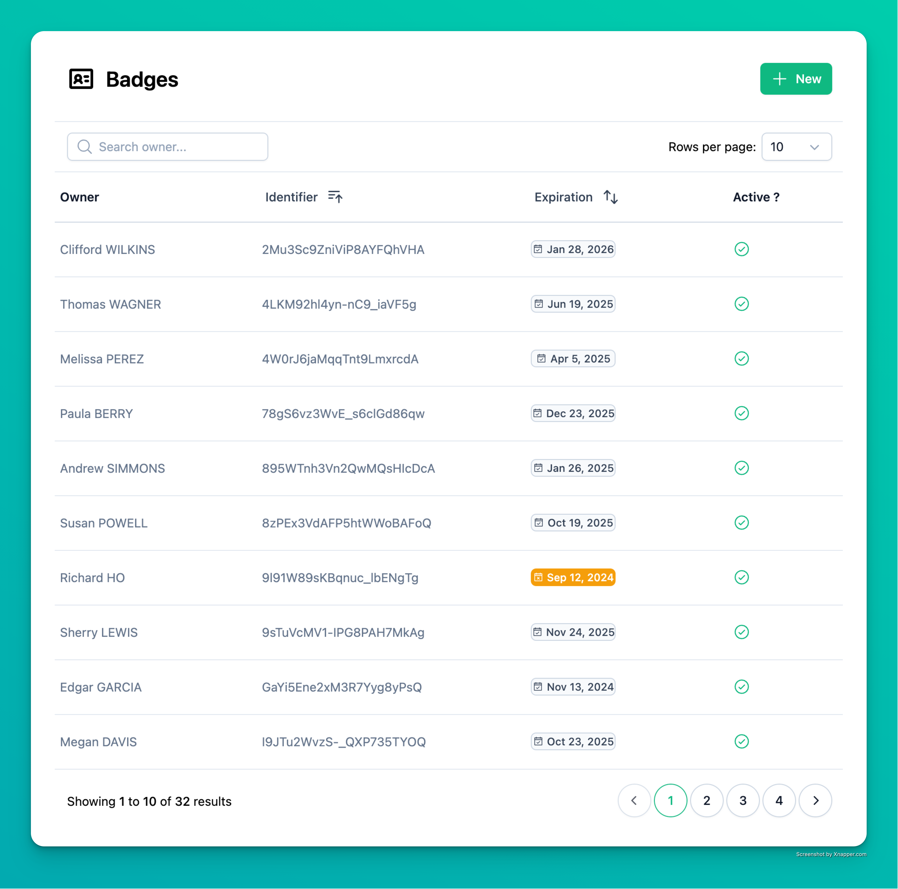
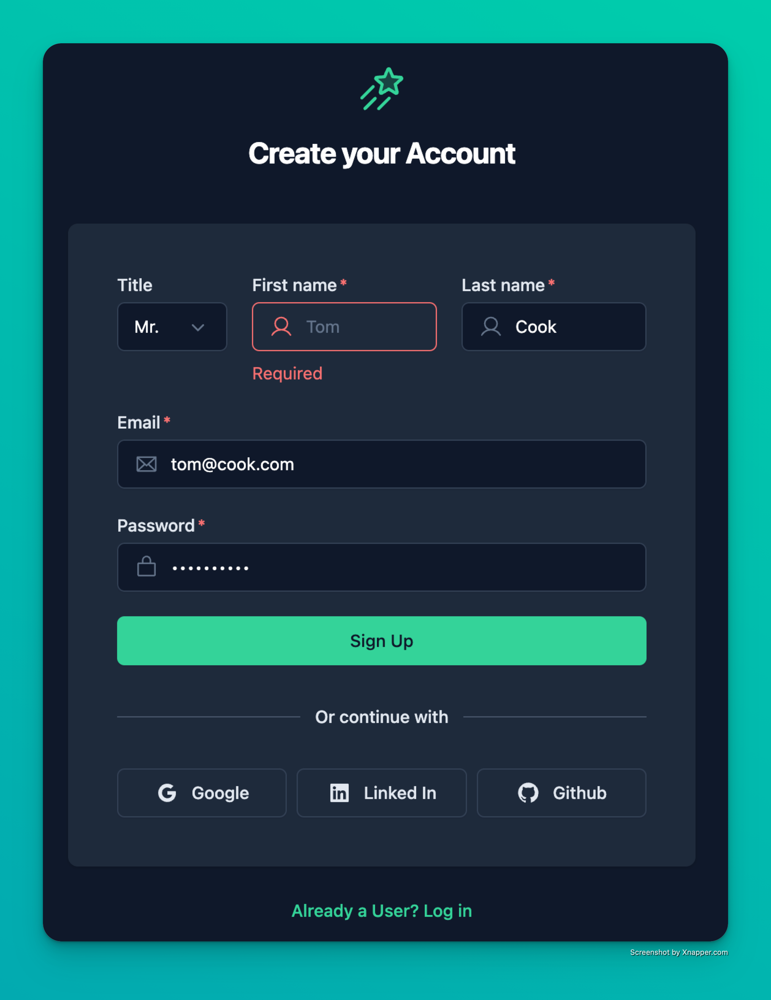

# 🔋 Fast Batteries 🔋

A modern and opinionated Full-Stack [**FastAPI**](https://fastapi.tiangolo.com/) template to kickstart a mid-sized project with built-in additional features (*batteries*).

The philosophy slightly differs from other templates, as it avoids relying on small external packages. This approach gives users full control over their code and reduces potential maintenance issues, especially with single-author, small-scale packages.

*A small portion* of these features are demonstrated in [a front-end demo](https://fast-batteries.ovh) (built with Nuxt 3) showcasing CRUD management and a signup/login workflow.

### 🧰 General Features
  - OAuth2 / JWT Authentication
  - Social login (with LinkedIn's complete workflow)
  - Query features: pagination, ordering, and filtering
  - Email templates using [MJML](https://mjml.io/), and [VS Code extension](https://marketplace.visualstudio.com/items?itemName=DanielKnights.vscode-mjml) for HTML generation
  - Background tasks with [Celery](https://docs.celeryq.dev/en/stable/)/[Beat](https://docs.celeryq.dev/en/latest/userguide/periodic-tasks.html), inclusding in-database scheduled tasks
  - S3-compatible file uploads with [MinIO](https://github.com/minio/minio)
  - Miscellaneous utilities, fields, schemas, functions, model mixins (timezone, timestamp, price, percentage, phone numbers, etc.)

### 🧑‍💻 Developer Experience
  - VS Code support for testing, debugging, tasks, and extensions
  - [VS Code devcontainers](https://code.visualstudio.com/docs/devcontainers/containers) for a fully isolated and reproducible development environment
  - [Ruff](https://docs.astral.sh/ruff/) for linting and formatting
  - Additional management scripts (interactive shell, database reset, superuser creation, ...)
  - Package management with [Poetry](https://python-poetry.org/)
  - Extensive comments and documentation to help with code modifications

### 🔧 Configuration
  - Strictly typed (Python 3.13 syntax) using [Pyright](https://github.com/microsoft/pyright)
  - [12-factors](https://12factor.net/) compliant, with strict separation of config and code
  - 3 levels of settings configuration: code-level, environment-level, and database-level
  - Custom exception classes and exception handler (errors are categorized to ease display in front-end)
  - Sync-first design, prioritizing ease of use over performance

### 💾 ORM & Database
  - ORM: [SQLAlchemy](https://www.sqlalchemy.org/) 2.0  (without [SQLModel](https://sqlmodel.tiangolo.com/))
  - Migrations: [Alembic](https://alembic.sqlalchemy.org/)
  - DBMS: [PostgreSQL](https://www.postgresql.org/)
  - A multi-purpose [Redis](https://redis.io/) store is available too (currently used as a Celery Broker)

### 🚀 Deployment & Monitoring
  - Production-ready hosting  with [Docker compose](https://docs.docker.com/compose/) (the demo is deployed with [Dokploy](https://docs.dokploy.com/docs/core/docker-compose))
  - All-in-one Observability with [Pydantic Logfire](https://pydantic.dev/logfire): logs, errors, metrics, alerts, SQL introspection, and background task results. Can be used as well in local environment to debug.
  - [pgAdmin](https://www.pgadmin.org/) for database management.
  - [Loguru](https://github.com/Delgan/loguru) for simple and clean logs.
  - CI with [Github actions](https://github.com/features/actions).

### 🧪 Tests
  - Batteries are tested with [Pytest](https://pytest.org/) (150+ tests)
  - Factories with [factory_boy](https://factoryboy.readthedocs.io/en/stable/) for test data generation
  - E2E test example with [Playwright](https://playwright.dev/)

### 🎨 Front-end
  - Demos: CRUD (including pagination/ordering/filtering) + login/signup workflow
  - Made with [Nuxt](https://nuxt.com/) (Vue.js) and [NuxtUI](https://ui.nuxt.com/) (uses [Tailwind CSS](https://tailwindcss.com/))
  - Dark mode support
  - Typescript interfaces and schemas auto-generation with [OpenAPI TypeScript](https://openapi-ts.dev/)

## Demo

You can try it [here](https://fast-batteries.ovh). E-mails will be sent for real, unless my free daily quota is reached.

## Documentation

Check the [`/doc` folder](./doc/) for various information.

## Contributions

I need help improving this template over time. Issues and PRs are very welcome. Here’s how you can contribute:
    - Make the current features more robust (fix mistakes, improve functionality, add use cases and tests, etc.)
    - Help develop new features (see the [roadmap](https://github.com/users/ddahan/projects/1))

## Public Roadmap

View it [here](https://github.com/users/ddahan/projects/1)

## FAQ / Philosophy

> **For battery 'X', why not use an external package?**

My goal is to rely only on well-maintained, widely-used, and well-documented libraries such as SQLAlchemy or Pydantic. For smaller or more specialized functionalities, I prefer a 'DIY' approach, building and extending code myself. This ensures full ownership and flexibility over the implementation. In the long term, I aim to avoid the risk of creating a patchwork of numerous small packages with poor external maintenance, which can compromise the project's sustainability as it grows.

> **Battery 'X' is incomplete**

I chose basic solutions over fully-featured implementations to make the template easier to understand. However, the code is yours, and you can extend it as needed. If you believe a missing feature is critical, feel free to open a PR or an issue.

> **Why is this template so opinionated / does not support 'X' ?**

I don’t have the time or skills to support every IDE, database, ORM, or older Python version. Offering too many options would also introduce unnecessary complexity. If you don’t use VS Code, you should probably avoid using this template directly.

> **There is a coupling between some batteries**

Batteries are often interconnected because it makes sense when not building an external packages.

> **Why choose Nuxt instead of Vue.js?**

Nuxt is not used here for its SSR abilities. However, Nuxt helps a lot to make the front-end stack *all-batteries-included*, especially thanks to Nuxt UI package. As the purpose of this template is not a front-end showcase, this should make sense here.

## Screenshots

## About me

I'm David, 36, living in Paris. Learn more about me [on my website](https://david-dahan.com)
