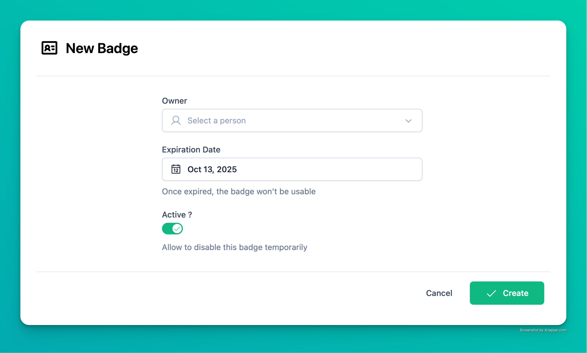

# 🔋 Fast Batteries 🔋

A modern and opinionated Full-Stack [**FastAPI**](https://fastapi.tiangolo.com/) template to start a middle-size project with built-in additional features (*batteries*).

The philosophy slightly differs from other templates, as it avoids relying on small external packages. This allows user to keep full power on its code and avoids potential maintenance issues, especially with single-author, small packages.

*A small part* of these features are illustrated with a [front-end demo](https://fast-batteries.ovh) (written in Nuxt 3) with CRUD management and a signup/login workflow.

### 🧰 General Features
  - OAuth2 / JWT Authentication
  - Social login (with Linked In full workflow)
  - Query features: pagination / ordering / filtering
  - Email templates using [MJML](https://mjml.io/), and [VS Code extension](https://marketplace.visualstudio.com/items?itemName=DanielKnights.vscode-mjml) for HTML generation
  - Background tasks using [Celery](https://docs.celeryq.dev/en/stable/)/[Beat](https://docs.celeryq.dev/en/latest/userguide/periodic-tasks.html), with in-database scheduled tasks
  - S3-compatible upload example with [MinIO](https://github.com/minio/minio)
  - Misc utils, fields, schemas, functions, model mixins (timezone, timestamp, price, percentage, phone numbers, etc.)

### 🧑‍💻 Developer Experience
  - VS Code testing, debugging, tasks, and extensions
  - [VS Code devcontainers](https://code.visualstudio.com/docs/devcontainers/containers) for fully isolated and reproducible development environment
  - [Ruff](https://docs.astral.sh/ruff/) for linting and formatting
  - Additional management commands (interactive shell, reset database, create superuser, ...)
  - Package management with [Poetry](https://python-poetry.org/)
  - Extensively commented and documented to help anyone modify the code.

### 🔧 Configuration
  - Strictly typed (Python 3.13 syntax) using [Pyright](https://github.com/microsoft/pyright)
  - [12-factors](https://12factor.net/) compliant, with strict separation of config and code
  - Settings can be configured in 3 complementary ways: within the code, with `.env` file, or loaded from database
  - Custom exception classes and exception handler (errors are split between general errors, form errors and field errors)
  - Sync-first (ease of use is preferred to performance)

### 💾 ORM & Database
  - ORM: [SQLAlchemy](https://www.sqlalchemy.org/) 2.0  (without [SQLModel](https://sqlmodel.tiangolo.com/))
  - Migrations: [Alembic](https://alembic.sqlalchemy.org/)
  - DBMS: [PostgreSQL](https://www.postgresql.org/)
  - A multi-purpose [Redis](https://redis.io/) store is available too (currently used as a Celery Broker)

### 🚀 Deployment & Monitoring
  - Production hosting ready with [Docker compose](https://docs.docker.com/compose/) (the demo is currently deployed with [Dokploy](https://docs.dokploy.com/docs/core/docker-compose))
  - All-in-one Observability with [Pydantic Logfire](https://pydantic.dev/logfire): logs, errors, metrics, alerts, SQL introspection, and background task results. Used in local environment as well for debugging.
  - [pgAdmin](https://www.pgadmin.org/) for database management.
  - [Loguru](https://github.com/Delgan/loguru) for simple and clean logs.
  - CI with [Github actions](https://github.com/features/actions).

### 🧪 Tests
  - Batteries are tested with [Pytest](https://pytest.org/) (150+ tests)
  - Factories with [factory_boy](https://factoryboy.readthedocs.io/en/stable/) to generate test data or initial local data (fixtures)
  - E2E test example with [Playwright](https://playwright.dev/)

### 🎨 Front-end
  - Demos: CRUD (including pagination/ordering/filtering) + login/signup workflow
  - Made with [Nuxt](https://nuxt.com/) (Vue.js) and [NuxtUI](https://ui.nuxt.com/) (uses [Tailwind CSS](https://tailwindcss.com/))
  - Dark mode support
  - Typescript interfaces and schemas auto-generation with [OpenAPI TypeScript](https://openapi-ts.dev/)

## Demo

You can try it [here](https://fast-batteries.ovh). E-mails will be sent for real, except if my free daily quota is reached.

## Documentation

See the [`/doc` folder](./doc/) containing diverse information. 

## Contributions

I really need help to make this template better over time. Issues and PRs are very welcome. Here is how you can help:
  - make the current batteries more solid (mistakes, cleaner ways to do, more use cases, more unit tests, ...)
  - help me build a new battery (cf. roadmap) from scratch.

## Roadmap

You can see it [here](https://github.com/users/ddahan/projects/1)

## FAQ / Philosophy

> **For battery 'X', why not use an external package?**

My goal is to rely only on well-maintained, widely-used, and well-documented libraries such as SQLAlchemy or Pydantic. For smaller or more specialized functionalities, I prefer a 'DIY' approach, building and extending code myself. This ensures full ownership and flexibility over the implementation. In the long term, I aim to avoid the risk of creating a patchwork of numerous small packages with poor external maintenance, which can compromise the project's sustainability as it grows.

> **Battery 'X' is incomplete**

I preferred basic solutions over full-featured ones. This should help anyone get to grips with this template more easily.
However, the code is yours, and you can extend it as needed. If you feel that a missing feature is essential, feel free to open a PR or an issue.

> **Why is this template so opinionated / does not support 'X' ?**

I don't have time and/or skills tu support all IDEs, databases, ORMS, or older Python versions. Besides, providing all the options would add lots of code complexity. If you don't use VS Code, you should probably NOT use this template directly.

> **There is a coupling between some batteries**

Batteries are often tied together because it just makes sense when not dealing with external packages. For example:
- all batteries rely on the `config.py` file to write their settings.
- when uploading an image, it's outsourced to Celery

> **Why choose Nuxt instead of Vue.js?**

Nuxt is not used here for its SSR abilities. However, it helps a lot to make the front-end stack *all-batteries-included*, especially thanks to Nuxt UI package. There are actually no additional packages. As the purpose of this template is not a front-end showcase, this should make sense here.

## Screenshots

## About me

I'm David, 36, living in Paris. Read more about me [on my website](https://david-dahan.com)
